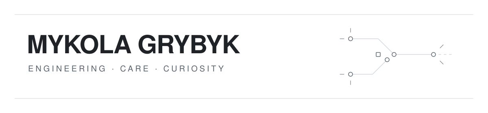

  

I build software mostly with **TypeScript, React and Node.js** — with a testing instinct that never really left.

Right now I'm working on [**LeapSpace at Elsevier**](https://www.sciencedirect.com/leapspace) — a research-grade AI workspace. Most of my work is frontend and Node.js middleware, but I also work across Java/Spring Boot services, CI/CD, architecture, our design system, and whatever else needs attention.

### Beyond software

I travel, stay active, and spend a lot of time exploring psychology, philosophy, and consciousness. Lately I've also been experimenting with whether some of those questions can be turned into software.

[LinkedIn](https://www.linkedin.com/in/mykola-grybyk/) · [CV](https://cv.mgrybyk.icu/) · [Email](mailto:mgrybyk@pm.me)
